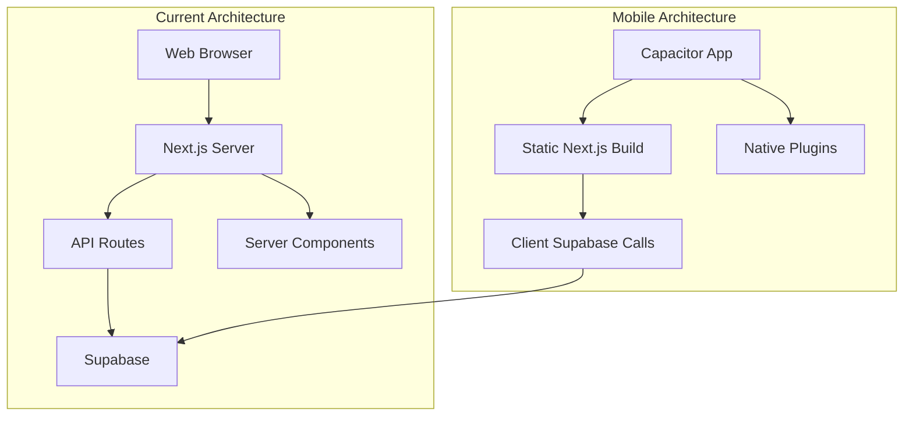

# Convert Next.js Web App to Capacitor Mobile App

## Overview

This plan converts the Next.js jewellery management web app into a mobile app using Capacitor. The main challenges are:

- Next.js API routes require a server (not available in mobile)
- Server-side authentication needs to move to client-side
- Static export configuration for Capacitor
- Native platform setup and configuration

## Architecture Changes




## Implementation Steps

### Phase 1: Prepare Next.js for Static Export

1. **Update `next.config.ts`** to enable static export

- Add `output: 'export'` configuration
- Configure `images.unoptimized: true` (Capacitor doesn't support Next.js image optimization)
- Set `trailingSlash: true` for better routing compatibility

2. **Remove or adapt server-only features**

- Remove `src/middleware.ts` (server-side middleware won't work in static export)
- Move authentication checks to client-side components
- Update protected routes to use client-side auth guards

3. **Update `package.json` scripts**

- Add `export` script: `"export": "next build"`
- Update build process for static output

### Phase 2: Migrate API Routes to Client-Side

All API routes in `src/app/api/` need to be converted to client-side Supabase calls:

1. **Create client-side service layer** (`src/lib/services/`)

- `inventory.service.ts` - Replace `/api/inventory` routes
- `customers.service.ts` - Replace `/api/customers` routes
- `billing.service.ts` - Replace `/api/billing/invoice` routes
- `reports.service.ts` - Replace `/api/reports/*` routes
- `analytics.service.ts` - Replace `/api/analytics/*` routes
- `settings.service.ts` - Replace `/api/settings` routes
- `gold-rate.service.ts` - Replace `/api/gold-rate` route

2. **Update hooks** (`src/lib/hooks/`)

- Modify existing hooks to use new service layer instead of API routes
- Ensure all hooks use Supabase client directly

3. **Remove API route files**

- Delete entire `src/app/api/` directory after migration

4. **Update authentication**

- Remove `src/lib/auth-api.ts` (server-side only)
- Use Supabase client auth directly in components/hooks
- Update `src/lib/supabase/client.ts` to handle mobile storage

### Phase 3: Install and Configure Capacitor

1. **Install Capacitor dependencies**
   ```bash
         npm install @capacitor/core @capacitor/cli
         npm install @capacitor/ios @capacitor/android
         npm install @capacitor/app @capacitor/status-bar @capacitor/splash-screen
         npm install @capacitor/keyboard @capacitor/network @capacitor/preferences
   ```


2. **Initialize Capacitor**

- Run `npx cap init` to create `capacitor.config.ts`
- Configure app ID, app name, and web directory

3. **Create `capacitor.config.ts`**

- Set `webDir` to `out` (Next.js static export directory)
- Configure server URL for development
- Set up iOS and Android bundle identifiers

### Phase 4: Platform-Specific Configuration

1. **iOS Configuration**

- Add iOS platform: `npx cap add ios`
- Configure `ios/App/App/Info.plist` for permissions
- Update `ios/App/App/capacitor.config.json` if needed
- Configure status bar and splash screen

2. **Android Configuration**

- Add Android platform: `npx cap add android`
- Update `android/app/src/main/AndroidManifest.xml` for permissions
- Configure `android/app/src/main/res/values/styles.xml` for theme
- Set up status bar and splash screen

3. **Native Plugin Setup**

- Configure Status Bar plugin for theme consistency
- Set up Splash Screen plugin
- Configure Keyboard plugin for better UX
- Set up Network plugin for offline detection
- Configure Preferences plugin for local storage

### Phase 5: Update Application Code for Mobile

1. **Update routing**

- Ensure all navigation works with Capacitor's routing
- Handle deep linking if needed
- Update any hardcoded URLs to use relative paths

2. **Mobile-specific UI adjustments**

- Add mobile-safe areas (notch, status bar)
- Update touch targets for mobile
- Optimize forms for mobile keyboards
- Add pull-to-refresh where appropriate

3. **Update environment handling**

- Detect Capacitor environment
- Handle platform-specific features
- Update Supabase client initialization for mobile

4. **File handling**

- Update PDF/Excel export to use Capacitor Filesystem plugin if needed
- Handle file downloads appropriately for mobile

### Phase 6: Build and Test

1. **Update build process**

- Modify `package.json` scripts:
    - `"build": "next build && npx cap sync"`
    - `"build:ios": "npm run build && npx cap sync ios && npx cap open ios"`
    - `"build:android": "npm run build && npx cap sync android && npx cap open android"`

2. **Development workflow**

- Add `"dev:mobile": "next dev & npx cap run ios"` for iOS development
- Add `"dev:android": "next dev & npx cap run android"` for Android development

3. **Testing checklist**

- Test authentication flow
- Test all CRUD operations
- Test offline functionality
- Test native features (status bar, keyboard, etc.)
- Test on physical devices

## Key Files to Modify

- `next.config.ts` - Add static export configuration
- `package.json` - Add Capacitor dependencies and scripts
- `src/middleware.ts` - Remove or convert to client-side
- `src/lib/auth-api.ts` - Remove (server-only)
- `src/app/api/**/*.ts` - Delete all API routes
- `src/lib/hooks/*.ts` - Update to use client-side services
- Create `src/lib/services/*.ts` - New service layer
- Create `capacitor.config.ts` - Capacitor configuration

## Considerations

1. **Authentication**: Supabase client-side auth works well with Capacitor. Use `@supabase/ssr` browser client.
2. **Offline Support**: Consider implementing offline-first patterns with Supabase real-time subscriptions and local caching.
3. **Performance**: Static export means no SSR benefits. Consider code splitting and lazy loading.
4. **Native Features**: Plan for future native features (camera for product photos, barcode scanning, etc.).
5. **App Store Requirements**: Prepare app icons, splash screens, and metadata for App Store/Play Store submission.

## Dependencies to Add

```json
{
  "@capacitor/core": "^latest",
  "@capacitor/cli": "^latest",
  "@capacitor/ios": "^latest",
  "@capacitor/android": "^latest",
  "@capacitor/app": "^latest",
  "@capacitor/status-bar": "^latest",
  "@capacitor/splash-screen": "^latest",
  "@capacitor/keyboard": "^latest",
  "@capacitor/network": "^latest",
  "@capacitor/preferences": "^latest"
}
```


## Migration Complexity

- **High**: API routes migration (requires careful refactoring)
- **Medium**: Authentication flow updates